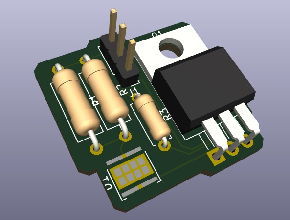
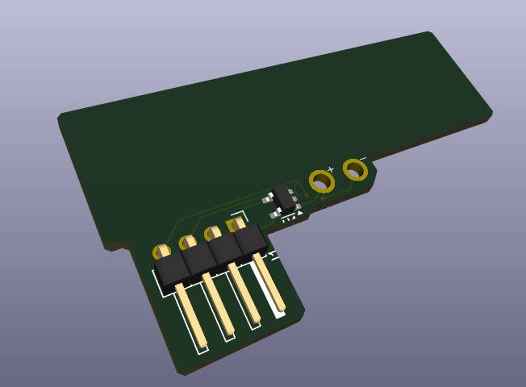
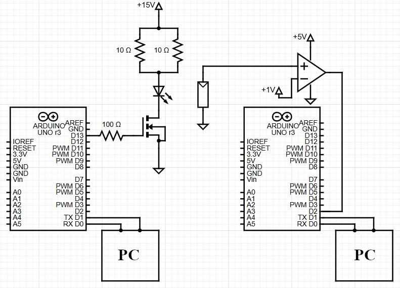

# 📡 Visual Light Communication System

A visual light communication system developed and designed to be used as ambient light. It uses two Arduinos to modulate and demodulate light transmissions at a high frequency so the user does not experience light flickering. This system can be used in any building requiring Wi-Fi coverage where structural layouts create areas with poor signal.

---

## 📋 How to Use

To use the system, upload the file `transmitter\tx_code\tx_code.ino` to one Arduino and the file `receiver\rx_code\rx_code.ino` to another. Then, follow one of two options to build the transmitter and receiver modules:

---

### __1. Using a PCB Model:__
To use a PCB model, utilize the fabrication files located under `transmitter\transmitter_board\fab_files` and `receiver\receiver_board\fab_files` to build both boards:

**<u>Transmitter Board:</u>**

The pins on the PCB are, from top to bottom: Power, Ground, and Signal. The signal pin connects to Arduino digital pin 13.

**<u>Receiver Board:</u>**

The receiver module requires a solar panel on the empty slot at the top. The pins on the PCB are, from left to right: Ground, Power (1V), Power (5V), and Signal. The signal pin connects to Arduino digital pin 2.

---

### __2. Building Your Own Module:__

By following the schematics, you can build the circuit on a protoboard or similar (this is how we tested our system).

> [!WARNING]
> Ensure that both 10Ω resistors in the transmitter module (left) are rated to withstand the required power without overheating.

Once everything is connected, start both Arduinos. Any message written through the serial port of the transmitter Arduino will be displayed through the serial port of the receiver Arduino.

> [!NOTE]
> The modulation algorithm is designed to work with individual uppercase and lowercase alphabetical characters, so words are transmitted character by character.

> [!CAUTION]
> If no data is received, or the data received is not the same as the one sent, ensure the solar panel receives sufficient light from the LED and that ambient light, such as solar, is not interfering.

---

## 🔮 Future Improvements
* Add the possibility to regulate the light intensity (Pulse Duty Cycle).
* Allow bidirectional communication.
* Enable the transmission of non-alphabetical characters.
* Test the system with more than one receiver.
* Add protocols for data transmission to increase the complexity and scale of the system.

---

## ⚖ License
MIT License 2025 - [Toni Calvo Belmonte](https://github.com/Toni-Calvo). Take a look at the [LICENSE.md](LICENSE.md) for more information.
